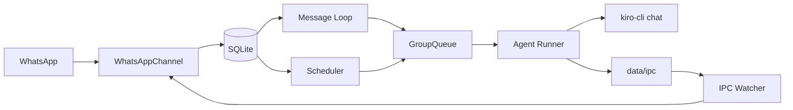

# Kiro-Claw


Personal WhatsApp assistant powered by **Kiro CLI** and a **custom Kiro agent**. It has 500+ tools like audio, video generation; email, calendar etc.

Kiro-Claw runs as a small Node.js service:
- Reads inbound WhatsApp messages
- Persists state in SQLite
- Launches `kiro-cli chat` for reasoning/execution
- Delivers responses back to WhatsApp

# Features of Kiro-Claw
- Can run 24 by 7
- 500+ plus tools
- Access via WhatApp
- Supports one-time and recurring scheduled tasks, just ask it to do something at certain time
- It has Agent.md file that it uses to remember your details and preference. It intimately knows you over a period of time. You can defini its soul there.
- For other memories it can create .md files, it can build Skill.md to develop skills
- Leverages Custom Agent feature of Kiro-CLI. It loads MCPs, Skills and Agents.md as per agent_config.json
- Setup is very easy. Just lauch Kiro-CLI in route folder and ask it to help you with setup. That is it!!!

## Architecture

This project extends Kiro-Assistant (a desktop coworker) into a 24*7 assistant. It uses the Kiro CLI Agent to run the agentic loop. It works with all models on Bedrock that are accessible to you through Kiro CLI (access to a wider model set is being rolled out). It runs as a service on Mac (Windows version coming soon..) and supports a wide range of MCP tools. It uses a SQL database at `store/messages.db` to remember scheduled tasks. You can ask Kiro-Claw to schedule a task and it will persist that in SQL. It stores user preferences in `Agents.md` under `groups/<group_name>/.kiro/steering/`, can create additional `.md` memory files in the group working directory (`groups/<group_name>/`), and can create skills for repetitive tasks. Kiro-CLI is launched as the custom agent `Kiro-Assistant`. Its configuration is defined in `~/.kiro/agents/agent_config.json`; this file configures MCPs and indicates where skill files are located.


### Talking to Kiro-Claw

You can talk to Kiro-Claw in two ways:
- Reach out to it with direct messages (DM).
- Reach out to it on a WhatsApp group (recommended).

For either option, you can:
- Use your own number for Kiro-Claw.
- Give Kiro-Claw its own dedicated number.


## Guided Setup With Kiro `setup` Skill

Start `kiro-cli` at the project root and ask:

`Use the setup skill to configure Kiro-Claw for WhatsApp and register my main group.`

The setup skill automates full bootstrap (not just WhatsApp auth):
1. Checks environment prerequisites and existing state (Node, `kiro-cli`, Kiro agent config, existing WhatsApp auth, existing registered groups).
2. Installs project dependencies.
3. Validates host runtime readiness (`npm run build`, `kiro-cli`, `~/.kiro/agents/agent_config.json`).
4. Handles WhatsApp authentication (QR browser, pairing code, or terminal QR), with retry flow.
5. Reads authenticated bot number from `store/auth/creds.json`.
6. Asks for trigger word and channel type (group vs DM/self-chat).
7. For group channels, syncs chats from WhatsApp and lists candidate groups with JIDs.
8. Maps selected group (confirmed by JID) to registration data (or uses DM JID), then registers the channel in `registered_groups` (`jid`, `folder`, trigger settings).
9. Supports later reconfiguration to move `main` to a different WhatsApp group.
10. Configures mount allowlist at `~/.config/nanoclaw/mount-allowlist.json`.
11. Builds and installs background service config (`launchd` on macOS, `systemd` on Linux), then loads/starts it.
12. Runs end-to-end verification (service status, Kiro CLI/config, WhatsApp auth, registered groups, mount config).
13. Provides log locations and troubleshooting guidance when checks fail.

Important detail: group name is used only for selection UX; runtime routing is done by registered JID.


### Sample run of guided setup

| Step | Script | What It Did |
|------|--------|-------------|
| 1 | 01-check-environment.sh | Verified Node.js 22.19.0, Kiro CLI, and agent config are present. No prior auth or groups found. |
| 2 | 02-install-deps.sh | Installed npm dependencies |
| 3 | 03-setup-runtime.sh | Ran npm run build, confirmed Kiro CLI and agent config are ready |
| 4 | 04-auth-whatsapp.sh + npm run auth | Launched WhatsApp QR auth in terminal. You scanned the QR code and linked successfully. Credentials saved to store/auth/ |
| 5 | 05-sync-groups.sh | Connected to WhatsApp and synced 96 groups into the local SQLite database |
| 5b | 05b-list-groups.sh | Listed groups matching "Kiro" — found Kiro-claw (120363408325112407@g.us) and Kiro |
| 6 | 06-register-channel.sh | Registered Kiro-claw group as the main channel with trigger @Kiro. (Had to manually create the registered_groups table first since the DB only had the chats table from sync) |
| 7 | 07-configure-mounts.sh | Configured mount allowlist at ~/.config/nanoclaw/mount-allowlist.json with access to ~/Documents |
| 8 | 08-setup-service.sh | Built the project, generated launchd plist at ~/Library/LaunchAgents/com.nanoclaw.plist, loaded the service |
| 9 | 09-verify.sh | Confirmed all components are green: service running, CLI available, auth valid, 1 group registered, mounts configured |

## WhatsApp Configuration

| Setting | Value |
|---------|-------|
| Bot Phone | 65******67 (your personal number) |
| Auth Method | QR code in terminal |
| Credentials | store/auth/ |
| Target Group | Kiro-claw |
| Group JID | 120363408325112407@g.us |
| Trigger Word | @Kiro |
| Channel Name | main |
| Folder | groups/main/ |
| Requires Trigger | Yes (must prefix with @Kiro in group) |

## Service Details

| Setting | Value |
|---------|-------|
| Service Type | macOS launchd |
| Plist | ~/Library/LaunchAgents/com.nanoclaw.plist |
| Node Path | /usr/local/bin/node |
| Kiro CLI Path | ~/.local/bin/kiro-cli |
| Logs | logs/nanoclaw.log, logs/nanoclaw.error.log |
| Mount Access | ~/Documents |

## How Kiro-CLI is launched to perform tasks?

Kiro-Claw launches Kiro through `container/agent-runner`:
- Command shape:
  - `kiro-cli chat --no-interactive --trust-all-tools --wrap never --agent <agentName> <prompt>`
- Agent name is read from:
  - `~/.kiro/agents/agent_config.json` (`name`)
  - or `KIRO_AGENT_NAME` env override
  - default fallback: `kiro-assistant`
- Optional model override:
  - `KIRO_MODEL`

Kiro-Claw passes `--resume` when a saved group session marker exists; first turn starts new, subsequent turns resume.

At run time, Kiro-Claw ensures your Kiro agent config (`~/.kiro/agents/agent_config.json`) includes:
- `nanoclaw` MCP server entry
- `@nanoclaw` in `tools` and `allowedTools`
- steering resource `file://.kiro/steering/Agents.md`

Kiro tool/MCP availability and resource loading come from this same agent config file, including skill/resource paths (commonly `~/.kiro/skills`).

## Steering Bootstrap

Before agent execution, Kiro-Claw bootstraps steering files if missing:
- `Agents_template.md` -> `groups/main/.kiro/steering/Agents.md` (create only if target missing)
- `Agents_global.md` -> `groups/global/.kiro/steering/Agents.md` (create only if target missing)

This bootstrap is performed by NanoClaw host code in `src/container-runner.ts` during agent-run preparation.

If target files already exist, Kiro-Claw leaves them untouched.

## Core Features

- WhatsApp message handling (Baileys)
- Group-level isolation (`groups/<group>/`)
- SQLite persistence (`store/messages.db`)
- Per-group queueing and backpressure
- Scheduler (`once`, `cron`, `interval`)
- MCP-based tool bridge (`send_message`, `schedule_task`, task controls)

## Architecture (High Level)



## Memory Model (Short)

Memory for Kiro comes from multiple layers:
- Prompt context from SQL (`messages` since last cursor)
- Group files in `groups/<group>/` (especially `.kiro/steering/*.md` and other memory `.md` files)
- Kiro custom-agent prompt/config from `~/.kiro/agents/agent_config.json`
- Task/run metadata in SQL (`scheduled_tasks`, `task_run_logs`)

For full details: `analyze_architecture/MEMORY.md`.

## Quick Start

Recommendation: for first-time setup, run the guided setup flow even if you plan to use `Quick Start` only. It configures WhatsApp auth, group/JID registration, and validation checks required by both run modes. If you only want foreground mode afterward, you can unload launchd service.

1. Install dependencies:
```bash
npm install
```

2. Authenticate WhatsApp:
```bash
npm run auth
```

3. Ensure Kiro CLI is installed and logged in:
```bash
kiro-cli whoami
```

4. Ensure your custom agent exists:
- `~/.kiro/agents/agent_config.json`
- Example agent name: `kiro-assistant`

5. Build and start:
```bash
npm run build
npm start
```

You can also ask Kiro to help with setup. Launch `kiro-cli` from the NanoClaw project root and ask it to set up Kiro-claw for you:
```bash
cd /path/to/nanoclaw
kiro-cli
```

## Run As Service (macOS launchd)

Quick Start vs Run As Service:
- `Quick Start` runs NanoClaw in the foreground (`npm start`) for local/manual use.
- `Run As Service` runs NanoClaw in background via launchd (`com.nanoclaw`) for 24x7 operation and auto-restart.
- For first-time setup in either mode, ensure at least one WhatsApp target is registered in `registered_groups` (setup skill handles this).

The setup skill runs:

```bash
./.kiro/skills/setup/scripts/08-setup-service.sh
```

What this script does on macOS:
- Runs `npm run build`
- Generates `~/Library/LaunchAgents/com.nanoclaw.plist`
- Sets launchd `ProgramArguments` to `node <project>/dist/index.js`
- Sets `WorkingDirectory`, `HOME`, stdout/stderr log paths
- Auto-computes service `PATH` (detected `kiro-cli` dir, detected `node` dir, `~/.local/bin`, `~/bin`, `~/.bun/bin`, `/opt/homebrew/bin`, `/usr/local/bin`, `/usr/bin`, `/bin`)
- Calls `launchctl load` and verifies service appears in `launchctl list`

```bash
# load service
launchctl load ~/Library/LaunchAgents/com.nanoclaw.plist

# unload service
launchctl unload ~/Library/LaunchAgents/com.nanoclaw.plist

# restart after build
launchctl kickstart -k gui/$(id -u)/com.nanoclaw

# view logs
tail -f logs/nanoclaw.log
tail -f logs/nanoclaw.error.log
```

## Docs

See `analyze_architecture/`:
- `Architecture.md`
- `CONFIGURATION.md`
- `MEMORY.md`
- `SCHEDULED_TASKS.md`
- `Launch_Kiro_nanoClaw.md`
- `Linting.md`

Troubleshooting:
- `docs/TROUBLESHOOTING.md`

## Roadmap

1. Package to run on Amazon Bedrock AgentCore.
2. Add more social interfaces like iMessage and Facebook Messenger.
3. Add accessibility features like Voice.
4. Implement support for file exchange on WhatsApp (currently not implemented in view of security).

## Credits

This project is inspired by [NanoClaw](https://github.com/qwibitai/nanoclaw), a clean implementation of Clawbot. We adapted the project to the Amazon Kiro and Bedrock ecosystem, and it works even better with a wide model choice (you can use your existing Kiro subscription).

The project follows the same integration approach as [Kiro-Assistant](https://github.com/aws-samples/sample-kiro-assistant), which this author also worked on.

## License

MIT
