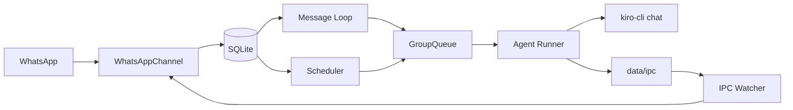

# Kiro-Claw

Personal WhatsApp assistant powered by **Kiro CLI** and a **custom Kiro agent**. It has 500+ tools like audio, video generation; email, calendar etc.

Kiro-Claw runs as a small Node.js service:
- Reads inbound WhatsApp messages
- Persists state in SQLite
- Launches `kiro-cli chat` for reasoning/execution
- Delivers responses back to WhatsApp

# Features of Kiro-Claw
- Can run 24 by 7
- 500+ plus tools
- Access via WhatApp
- Supports one-time and recurring scheduled tasks, just ask it to do something at certain time
- It has Agent.md file that it uses to remember your details and preference. It intimately knows you over a period of time. You can defini its soul there.
- For other memories it can create .md files, it can build Skill.md to develop skills
- Leverages Custom Agent feature of Kiro-CLI. It loads MCPs, Skills and Agents.md as per agent_config.json
- Setup is very easy. Just lauch Kiro-CLI in route folder and ask it to help you with setup. That is it!!!

## Quick Start

1. Install dependencies:
```bash
npm install
```

2. Authenticate WhatsApp:
```bash
npm run auth
```

3. Ensure Kiro CLI is installed and logged in:
```bash
kiro-cli whoami
```

4. Ensure your custom agent exists:
- `~/.kiro/agents/agent_config.json`
- Example agent name: `kiro-assistant`

5. Build and start:
```bash
npm run build
npm start
```

You can also ask Kiro to help with setup. Launch `kiro-cli` from the NanoClaw project root and ask it to set up Kiro-claw for you:
```bash
cd /path/to/nanoclaw
kiro-cli
```

## How Kiro Is Used

Kiro-Claw launches Kiro through `container/agent-runner`:
- Command shape:
  - `kiro-cli chat --no-interactive --trust-all-tools --wrap never --agent <agentName> <prompt>`
- Agent name is read from:
  - `~/.kiro/agents/agent_config.json` (`name`)
  - or `KIRO_AGENT_NAME` env override
  - default fallback: `kiro-assistant`
- Optional model override:
  - `KIRO_MODEL`

Kiro-Claw passes `--resume` when a saved group session marker exists; first turn starts new, subsequent turns resume.

At run time, Kiro-Claw ensures your Kiro agent config (`~/.kiro/agents/agent_config.json`) includes:
- `nanoclaw` MCP server entry
- `@nanoclaw` in `tools` and `allowedTools`
- steering resource `file://.kiro/steering/Agents.md`

Kiro tool/MCP availability and resource loading come from this same agent config file, including skill/resource paths (commonly `~/.kiro/skills`).

## Steering Bootstrap

Before agent execution, Kiro-Claw bootstraps steering files if missing:
- `Agents_template.md` -> `groups/main/.kiro/steering/Agents.md` (create only if target missing)
- `Agents_global.md` -> `groups/global/.kiro/steering/Agents.md` (create only if target missing)

If target files already exist, Kiro-Claw leaves them untouched.

## Core Features

- WhatsApp message handling (Baileys)
- Group-level isolation (`groups/<group>/`)
- SQLite persistence (`store/messages.db`)
- Per-group queueing and backpressure
- Scheduler (`once`, `cron`, `interval`)
- MCP-based tool bridge (`send_message`, `schedule_task`, task controls)

## Architecture (High Level)



## Memory Model (Short)

Memory for Kiro comes from multiple layers:
- Prompt context from SQL (`messages` since last cursor)
- Group files in `groups/<group>/` (especially `.kiro/steering/*.md` and other memory `.md` files)
- Kiro custom-agent prompt/config from `~/.kiro/agents/agent_config.json`
- Task/run metadata in SQL (`scheduled_tasks`, `task_run_logs`)

For full details: `analyze_architecture/MEMORY.md`.

## Run As Service (macOS launchd)

```bash
# load service
launchctl load ~/Library/LaunchAgents/com.nanoclaw.plist

# unload service
launchctl unload ~/Library/LaunchAgents/com.nanoclaw.plist

# restart after build
launchctl kickstart -k gui/$(id -u)/com.nanoclaw

# view logs
tail -f logs/nanoclaw.log
tail -f logs/nanoclaw.error.log
```

## Docs

See `analyze_architecture/`:
- `Architecture.md`
- `CONFIGURATION.md`
- `MEMORY.md`
- `SCHEDULED_TASKS.md`
- `Launch_Kiro_nanoClaw.md`
- `Linting.md`

## License

MIT
