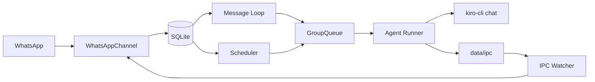

# NanoClaw

Personal WhatsApp assistant powered by **Kiro CLI** and a **custom Kiro agent**.

NanoClaw runs as a small Node.js service:
- Reads inbound WhatsApp messages
- Persists state in SQLite
- Launches `kiro-cli chat` for reasoning/execution
- Delivers responses back to WhatsApp
- Supports one-time and recurring scheduled tasks

## Quick Start

1. Install dependencies:
```bash
npm install
```

2. Authenticate WhatsApp:
```bash
npm run auth
```

3. Ensure Kiro CLI is installed and logged in:
```bash
kiro-cli whoami
```

4. Ensure your custom agent exists:
- `~/.kiro/agents/agent_config.json`
- Example agent name: `kiro-assistant`

5. Build and start:
```bash
npm run build
npm start
```

## How Kiro Is Used

NanoClaw launches Kiro through `container/agent-runner`:
- Command shape:
  - `kiro-cli chat --no-interactive --trust-all-tools --wrap never --agent <agentName> [--resume] <prompt>`
- Agent name is read from:
  - `~/.kiro/agents/agent_config.json` (`name`)
  - or `KIRO_AGENT_NAME` env override
- Optional model override:
  - `KIRO_MODEL`

At run time, NanoClaw ensures your Kiro agent config includes a `nanoclaw` MCP entry and `@nanoclaw` tool tags so task/message tools remain available.

## Core Features

- WhatsApp message handling (Baileys)
- Group-level isolation (`groups/<group>/`)
- SQLite persistence (`store/messages.db`)
- Per-group queueing and backpressure
- Scheduler (`once`, `cron`, `interval`)
- MCP-based tool bridge (`send_message`, `schedule_task`, task controls)

## Architecture (High Level)



## Memory Model (Short)

Memory for Kiro comes from multiple layers:
- Prompt context from SQL (`messages` since last cursor)
- Kiro conversation continuation via `--resume` in the same group working directory
- Group files in `groups/<group>/` (including `CLAUDE.md` if used by agent/tools)
- Kiro custom-agent prompt/config from `~/.kiro/agents/agent_config.json`
- Task/run metadata in SQL (`scheduled_tasks`, `task_run_logs`)

For full details: `analyze_architecture/MEMORY.md`.

## Run As Service (macOS launchd)

```bash
# restart after build
launchctl kickstart -k gui/$(id -u)/com.nanoclaw

# view logs
tail -f logs/nanoclaw.log
tail -f logs/nanoclaw.error.log
```

## Docs

See `analyze_architecture/`:
- `architecture.md`
- `CONFIGURATION.md`
- `MEMORY.md`
- `SCHEDULED_TASKS.md`
- `Launch_Claude.md` (kept filename, content is Kiro launch path)

## License

MIT
