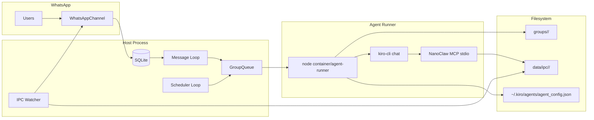
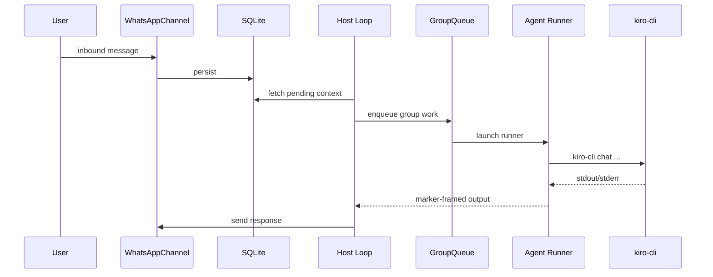

# NanoClaw Architecture (Kiro CLI)

NanoClaw is a single Node.js host that connects WhatsApp to Kiro CLI custom-agent runs.

## Component Diagram

## Building Blocks

### WhatsApp Channel
- File: `src/channels/whatsapp.ts`
- Maintains WA connection, message ingest, outbound sends.

### Database Layer
- File: `src/db.ts`
- Stores messages, groups, session markers, task rows, task run logs.

### Message Loop
- File: `src/index.ts`
- Polls SQL for new inbound messages and routes by group.

### Group Queue
- File: `src/group-queue.ts`
- Serializes work per group, handles active process piping and graceful close.

### Scheduler
- File: `src/task-scheduler.ts`
- Polls due tasks and queues execution.

### IPC Watcher
- File: `src/ipc.ts`
- Consumes MCP-written files (`messages`, `tasks`) and applies commands.

### Container Runner (host-side spawner)
- File: `src/container-runner.ts`
- Prepares env/dirs and spawns `container/agent-runner/dist/index.js`.

### Agent Runner (Kiro backend)
- File: `container/agent-runner/src/index.ts`
- Resolves Kiro agent config
- Ensures NanoClaw MCP is wired into custom agent config
- Executes `kiro-cli chat` and emits marker-framed outputs

## Message Flow

## Task Flow

```mermaid
sequenceDiagram
    participant K as Kiro Run
    participant MCP as NanoClaw MCP
    participant IPC as data/ipc/<group>/tasks
    participant W as IPC Watcher
    participant DB as SQLite
    participant S as Scheduler
    participant Q as GroupQueue
    participant R as Agent Runner

    K->>MCP: schedule_task
    MCP->>IPC: write task file
    W->>IPC: read file
    W->>DB: createTask
    S->>DB: getDueTasks
    S->>Q: enqueue task
    Q->>R: run task prompt
    R->>K: kiro-cli chat
    R->>DB: task run logs + updateTaskAfterRun
```

## Key Runtime Notes

- Group execution is serialized; long runs can delay other due tasks for the same group.
- Session continuity combines SQL marker persistence and Kiro CLI resume behavior.
- MCP tool bridge is file-based via IPC directories, not direct DB/WA calls from Kiro.
