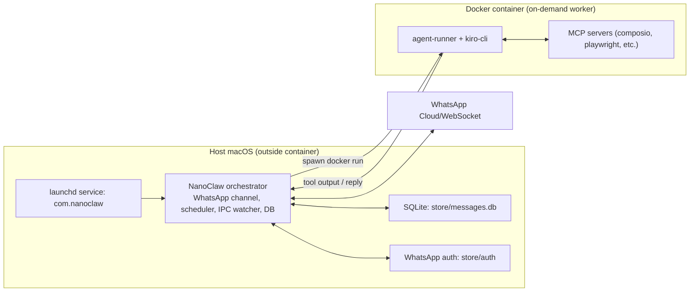

# Containerization (Docker Desktop)

## 1) What Runs Where

Current runtime model is **hybrid**:
- Host process (`com.nanoclaw` via `launchd`) handles WhatsApp connection, scheduler, IPC watcher.
- Agent execution is containerized: host spawns `nanoclaw-agent:latest` containers on demand.

So it is expected to see:
- `launchctl list | grep nanoclaw` -> running host orchestrator
- `docker ps` -> empty when idle, active `nanoclaw-main-...` container only during agent work

### Container Boundary Diagram



## 2) Why Hybrid Architecture

NanoClaw separates control plane and execution plane:
- Host process keeps long-lived stateful responsibilities stable:
  - WhatsApp Web session/socket lifecycle
  - scheduler loop and IPC watcher
  - local SQLite state + launchd supervision
- Containers isolate agent runs:
  - tool execution and dependencies
  - crash/timeout impact bounded to the run container
  - rebuild/upgrade of agent image without replacing the always-on service loop

Practical result:
- If one Kiro run hangs/crashes, WhatsApp connectivity and scheduling remain alive.
- Containers are short-lived workers; host service is persistent orchestrator.

## 3) How the Container Is Built

Primary path:
```bash
./.kiro/skills/setup/scripts/03-setup-container.sh
```

Equivalent direct build:
```bash
docker build -t nanoclaw-agent:latest ./container
```

Key build details:
- Image installs `kiro-cli` in container.
- Entry point is `/app/entrypoint.sh` (reads JSON from stdin, runs agent-runner).
- Agent runner code is in `container/agent-runner`.

## 4) Runtime Mounts (Host -> Container)

Configured in `src/container-runner.ts`:
- `groups/<group>` -> `/workspace/group`
- `groups/global` -> `/workspace/global`
- `groups/extra` -> `/workspace/extra`
- `ipc/<group>` -> `/workspace/ipc`
- `~/.kiro` -> `/home/node/.kiro`
- `~/.aws` -> `/home/node/.aws`
- `~/Library/Application Support/kiro-cli` -> `/home/node/.local/share/kiro-cli`

Last two mounts were critical for Kiro auth persistence in containerized runs.

## 5) How to Verify Process + Container

Check service:
```bash
launchctl list | grep nanoclaw
```

Check containers:
```bash
docker ps
```

Check app logs:
```bash
tail -f logs/nanoclaw.log
```

Healthy signs in logs:
- `Connected to WhatsApp`
- `Scheduler loop started`
- `Spawning agent process` with `runtime: "docker"`
- `Message sent`

## 6) WhatsApp Authentication (What We Had To Do)

When logged out / 401:
1. Re-auth:
```bash
npm run auth
```
2. If stale session, move old auth and retry:
```bash
mv store/auth store/auth.bak.$(date +%s)
npm run auth
```
3. Pairing-code mode (optional):
```bash
npm run auth -- --pairing-code --phone <your_number_with_country_code>
```

After success, credentials persist under `store/auth`, so restart normally keeps auth.

## 7) Kiro Authentication (What We Had To Do)

Symptoms:
- Container runs failed with:
  - `Failed to open browser for authentication`

Actions taken:
1. Verified host login:
```bash
kiro-cli whoami
```
2. Identified container was missing auth state visibility.
3. Added persistent mounts in `src/container-runner.ts`:
   - `~/.aws`
   - `~/Library/Application Support/kiro-cli`
4. Rebuild + restart:
```bash
npm run build
./.kiro/skills/setup/scripts/03-setup-container.sh
./.kiro/skills/setup/scripts/08-setup-service.sh
```
5. Verified container sees login:
```bash
docker run --rm \
  -v "$HOME/.kiro:/home/node/.kiro" \
  -v "$HOME/.aws:/home/node/.aws" \
  -v "$HOME/Library/Application Support/kiro-cli:/home/node/.local/share/kiro-cli" \
  --entrypoint /usr/local/bin/kiro-cli \
  nanoclaw-agent:latest whoami
```

## 8) What Was Done So You Don’t Have To Repeat It

Persistent fixes already in code:
- Added `~/.aws` mount to container runtime.
- Added `~/Library/Application Support/kiro-cli` mount to container runtime.

Operationally persistent:
- WhatsApp auth persists in `store/auth`.
- Kiro auth persists in host auth locations now mounted into runtime containers.
- Service restarts use same launchd plist (`com.nanoclaw`).

As long as those host auth directories are not deleted, re-auth should not be needed on each restart.

## 9) `launchctl load` Behavior

If you run:

```bash
launchctl load ~/Library/LaunchAgents/com.nanoclaw.plist
```

it starts the **host orchestrator process** (`com.nanoclaw`), not a permanent always-on agent container.

By default this project launches agent runs in Docker because:
- `NANOCLAW_AGENT_RUNTIME` defaults to `docker` in `src/config.ts`.
- Your plist does not override `NANOCLAW_AGENT_RUNTIME`.

So, after `launchctl load`, agent containers are still created **on demand** when messages/tasks are processed.

## 10) Switch Runtime to Host (No Containers)

If you want NanoClaw to run agent turns directly on host (not Docker), set
`NANOCLAW_AGENT_RUNTIME=host` in the launchd plist and reload service:

```bash
launchctl unload ~/Library/LaunchAgents/com.nanoclaw.plist

PLIST=~/Library/LaunchAgents/com.nanoclaw.plist
if /usr/libexec/PlistBuddy -c "Print :EnvironmentVariables:NANOCLAW_AGENT_RUNTIME" "$PLIST" >/dev/null 2>&1; then
  /usr/libexec/PlistBuddy -c "Set :EnvironmentVariables:NANOCLAW_AGENT_RUNTIME host" "$PLIST"
else
  /usr/libexec/PlistBuddy -c "Add :EnvironmentVariables:NANOCLAW_AGENT_RUNTIME string host" "$PLIST"
fi

launchctl load ~/Library/LaunchAgents/com.nanoclaw.plist
launchctl kickstart -k gui/$(id -u)/com.nanoclaw
```

Verify runtime mode:

```bash
plutil -p ~/Library/LaunchAgents/com.nanoclaw.plist | rg NANOCLAW_AGENT_RUNTIME
rg -n 'runtime.*host' logs/nanoclaw.log | tail -n 5
```

To switch back to Docker:

```bash
launchctl unload ~/Library/LaunchAgents/com.nanoclaw.plist
/usr/libexec/PlistBuddy -c "Set :EnvironmentVariables:NANOCLAW_AGENT_RUNTIME docker" ~/Library/LaunchAgents/com.nanoclaw.plist
launchctl load ~/Library/LaunchAgents/com.nanoclaw.plist
launchctl kickstart -k gui/$(id -u)/com.nanoclaw
```

## 11) Session Resumption (`--resume`) Implementation

Session continuity is now explicit and code-driven.

Where it is implemented:
- Host reads/stores per-group session marker in SQL `sessions` table:
  - `src/db.ts` (`getSession`, `setSession`, `getAllSessions`)
  - `src/index.ts` (`sessions[group.folder]`, passed into `runContainerAgent(...)`, updated from `output.newSessionId`)
- Agent runner adds `--resume` when a session marker is present:
  - `container/agent-runner/src/index.ts`

Relevant code (exact location):
```ts
// container/agent-runner/src/index.ts
const hasSession = typeof input.sessionId === 'string' && input.sessionId.trim().length > 0;
...
if (hasSession) {
  args.push('--resume');
}
```

Runtime flow:
1. Host loads session marker for group (example value: `kiro:main`).
2. Host sends `sessionId` in runner input.
3. Runner appends `--resume` to `kiro-cli chat` args when `sessionId` exists.
4. Runner emits `newSessionId`.
5. Host persists marker back to SQL for next turn.

Result: multi-turn context does not depend on container staying alive; each new run can resume.

## 12) One-Shot Container Mode (Orphan Prevention)

Current mode is one-shot by default.

Where configured:
- `src/config.ts`:
  - `AGENT_ONE_SHOT` defaults to `true`
  - override with env: `NANOCLAW_AGENT_ONE_SHOT=false` to revert to long-lived behavior

How one-shot is enforced:
- Host disables IPC follow-up piping to active container in one-shot mode:
  - `src/index.ts` uses `if (!AGENT_ONE_SHOT && queue.sendMessage(...))`
  - in one-shot mode, new messages are queued for a fresh container run
- Host passes one-shot flag into runtime env:
  - `src/container-runner.ts` sets `NANOCLAW_AGENT_ONE_SHOT`
- Runner exits after a single successful Kiro run:
  - `container/agent-runner/src/index.ts`:
    - checks `AGENT_ONE_SHOT`
    - logs `One-shot mode enabled, exiting after single run`
    - breaks loop instead of waiting on IPC `_close`

Shutdown cleanup to avoid orphan containers:
- `src/group-queue.ts` now terminates active agent processes on shutdown/restart:
  - sends `SIGTERM`, then `SIGKILL` after grace period if needed
  - best-effort `docker rm -f <container-name>` for Docker runtime

Expected operational outcome:
- `docker ps` is typically empty while idle
- at most short-lived `nanoclaw-main-*` containers appear during active runs
- no growing pile of detached/orphan containers after `launchctl kickstart/load/unload`

## 13) Kiro SQL DB Location + `conversations_v2` Path Values

### Is Kiro SQL DB same for container and non-container runs?

Yes, in this project it is the same host DB file in both modes:
- Host absolute path:
  - `/Users/girpatil/Library/Application Support/kiro-cli/data.sqlite3`

Why:
- Docker mode bind-mounts host Kiro data dir into container:
  - `src/container-runner.ts` mounts
    - `~/Library/Application Support/kiro-cli` -> `/home/node/.local/share/kiro-cli` (`src/container-runner.ts`)
- Runner sets Kiro `HOME` from `NANOCLAW_REAL_HOME`, so host mode and docker mode both resolve Kiro home consistently (`container/agent-runner/src/index.ts`).

### What path appears in `conversations_v2`?

`conversations_v2` is a key-value table. The workspace path is stored in the `key` column (not `workspace_path` column).

Path value depends on runtime where `kiro-cli` was launched:
- Containerized runs:
  - `key = /workspace/group`
  - because runner `cwd` is `GROUP_DIR` and in docker env `NANOCLAW_GROUP_DIR=/workspace/group`
- Non-container host runs:
  - `key = /Users/girpatil/Documents/Coding/ClaudeCode/cowork/nanoclaw/groups/main` (or corresponding host workspace path)
  - because `NANOCLAW_GROUP_DIR` is set to host `groups/<group>` path by host runner

So seeing both `/workspace/group` and absolute macOS paths in `conversations_v2.key` is expected if you have run both runtime modes over time.
