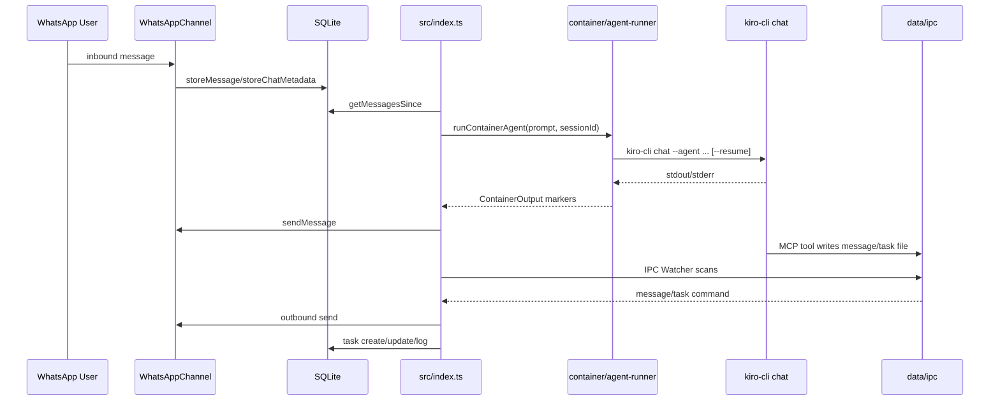

# NanoClaw Kiro Integration

NanoClaw uses **Kiro CLI** as the execution engine and a **custom Kiro agent** from:
- `~/.kiro/agents/agent_config.json`

## Runtime Flow

## Kiro Command Shape

NanoClaw executes:
- `kiro-cli chat --no-interactive --trust-all-tools --wrap never --agent <name> [--resume] <prompt>`

Resolution rules:
- Agent name: `KIRO_AGENT_NAME` override or `~/.kiro/agents/agent_config.json:name`
- Model override: `KIRO_MODEL` (optional)
- Working directory: `groups/<group>/`

## Custom Agent + MCP Injection

Before launching Kiro, NanoClaw updates your Kiro agent config to ensure:
- `mcpServers.nanoclaw` points to `container/agent-runner/dist/ipc-mcp-stdio.js`
- `tools` includes `@nanoclaw`
- `allowedTools` includes `@nanoclaw`

This keeps task/message tools available to Kiro runs.

## Session Continuity

- Host persists per-group session markers in SQL (`sessions` table)
- Runner currently writes synthetic IDs like `kiro:<groupFolder>`
- `--resume` is passed when session marker exists
- Practical continuity also depends on Kiro’s own conversation state for the same cwd

## Operational Notes

- If one scheduled task run stays active for a long time, queued due tasks for the same group wait behind it (group queue is serialized per group).
- Kiro CLI warnings about unavailable/disabled MCP servers do not always block core chat execution.
