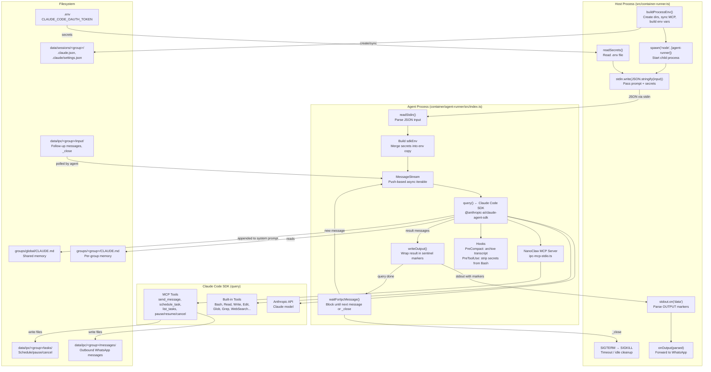
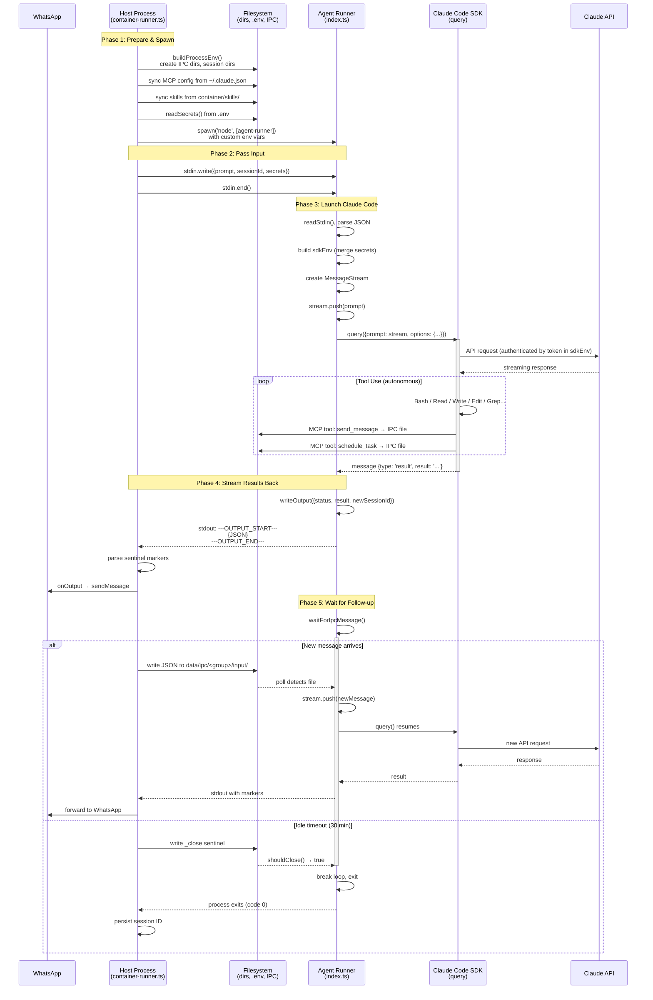

# How NanoClaw Launches Claude Code

This document traces the complete code path from a WhatsApp message arriving to Claude Code executing and streaming a response back. Two files are involved:

- **Host side**: `src/container-runner.ts` — spawns the agent process, passes input, reads output
- **Agent side**: `container/agent-runner/src/index.ts` — receives input, calls the Claude Code SDK, streams results back

## Architecture Diagram



## Sequence Diagram



## Phase 1: Host Prepares and Spawns the Agent Process

### 1.1 Build the environment (`src/container-runner.ts:47-163`)

```typescript
function buildProcessEnv(group, isMain): Record<string, string> {
```

Before spawning, `buildProcessEnv()` sets up everything the agent process needs:

```typescript
// Per-group IPC namespace — agent reads/writes files here for messaging and tasks
const groupIpcDir = path.join(DATA_DIR, 'ipc', group.folder);
fs.mkdirSync(path.join(groupIpcDir, 'messages'), { recursive: true });
fs.mkdirSync(path.join(groupIpcDir, 'tasks'), { recursive: true });
fs.mkdirSync(path.join(groupIpcDir, 'input'), { recursive: true });
```

```typescript
// Per-group Claude session directory — isolated from other groups
const groupSessionsDir = path.join(DATA_DIR, 'sessions', group.folder, '.claude');
fs.mkdirSync(groupSessionsDir, { recursive: true });
```

```typescript
// Create settings.json if it doesn't exist (enables agent teams, memory)
if (!fs.existsSync(settingsFile)) {
  fs.writeFileSync(settingsFile, JSON.stringify({
    env: {
      CLAUDE_CODE_EXPERIMENTAL_AGENT_TEAMS: '1',
      CLAUDE_CODE_ADDITIONAL_DIRECTORIES_CLAUDE_MD: '1',
      CLAUDE_CODE_DISABLE_AUTO_MEMORY: '0',
    },
  }, null, 2) + '\n');
}
```

```typescript
// Sync MCP servers from user's real ~/.claude.json into per-group session
const realHome = os.homedir();
const userClaudeJson = path.join(realHome, '.claude.json');
if (fs.existsSync(userClaudeJson)) {
  const userConfig = JSON.parse(fs.readFileSync(userClaudeJson, 'utf-8'));
  if (userConfig.mcpServers) {
    sessionConfig.mcpServers = userConfig.mcpServers;
    fs.writeFileSync(sessionClaudeJson, JSON.stringify(sessionConfig, null, 2) + '\n');
  }
}
```

```typescript
// Final environment variables passed to the child process
const env: Record<string, string> = {
  NANOCLAW_GROUP_DIR: groupDir,         // groups/<folder>/
  NANOCLAW_IPC_DIR: groupIpcDir,        // data/ipc/<folder>/
  NANOCLAW_GLOBAL_DIR: 'groups/global', // shared CLAUDE.md
  NANOCLAW_EXTRA_DIR: extraDir,         // data/extra/<folder>/ (symlinks)
  HOME: path.dirname(groupSessionsDir), // data/sessions/<folder>/ — makes ~/.claude/ per-group
  PATH: process.env.PATH || '',
};
```

### 1.2 Spawn the Node.js child process (`src/container-runner.ts:219-223`)

```typescript
const agentRunnerEntry = path.join(
  process.cwd(), 'container', 'agent-runner', 'dist', 'index.js',
);

const container = spawn('node', [agentRunnerEntry], {
  stdio: ['pipe', 'pipe', 'pipe'],  // stdin, stdout, stderr — all piped
  cwd: groupDir,                     // working directory = groups/<folder>/
  env: processEnv,                   // custom env from buildProcessEnv()
});
```

This starts the agent-runner as a child process. The `stdio: ['pipe', ...]` means the host can write to stdin and read from stdout/stderr programmatically.

### 1.3 Pass secrets via stdin (`src/container-runner.ts:232-237`)

```typescript
// Read Claude token from .env file
function readSecrets(): Record<string, string> {
  return readEnvFile(['CLAUDE_CODE_OAUTH_TOKEN', 'ANTHROPIC_API_KEY']);
}

// Send the full input (prompt + secrets) as JSON via stdin
input.secrets = readSecrets();
container.stdin.write(JSON.stringify(input));
container.stdin.end();
// Scrub secrets from the object so they don't appear in logs
delete input.secrets;
```

The input JSON looks like:
```json
{
  "prompt": "<messages>...</messages>",
  "sessionId": "abc-123",
  "groupFolder": "main",
  "chatJid": "120363...@g.us",
  "isMain": true,
  "secrets": { "CLAUDE_CODE_OAUTH_TOKEN": "..." }
}
```

Secrets are **never** written to disk or passed as environment variables — only via stdin, then immediately deleted from memory.

## Phase 2: Agent-Runner Receives Input and Prepares

### 2.1 Read stdin (`container/agent-runner/src/index.ts:104-112, 499-515`)

```typescript
async function readStdin(): Promise<string> {
  return new Promise((resolve, reject) => {
    let data = '';
    process.stdin.setEncoding('utf8');
    process.stdin.on('data', chunk => { data += chunk; });
    process.stdin.on('end', () => resolve(data));
    process.stdin.on('error', reject);
  });
}

// In main():
const stdinData = await readStdin();
containerInput = JSON.parse(stdinData);
```

### 2.2 Prepare SDK environment (`container/agent-runner/src/index.ts:517-522`)

```typescript
// Merge secrets into a copy of process.env for the SDK
// Secrets never touch process.env itself — Bash subprocesses can't see them
const sdkEnv: Record<string, string | undefined> = { ...process.env };
for (const [key, value] of Object.entries(containerInput.secrets || {})) {
  sdkEnv[key] = value;  // CLAUDE_CODE_OAUTH_TOKEN goes here
}
```

### 2.3 Resolve paths (`container/agent-runner/src/index.ts:59-66`)

```typescript
// Environment variables set by host, with container fallbacks
const GROUP_DIR    = process.env.NANOCLAW_GROUP_DIR    || '/workspace/group';
const IPC_BASE_DIR = process.env.NANOCLAW_IPC_DIR      || '/workspace/ipc';
const GLOBAL_DIR   = process.env.NANOCLAW_GLOBAL_DIR   || '/workspace/global';
const EXTRA_DIR    = process.env.NANOCLAW_EXTRA_DIR     || '/workspace/extra';

const IPC_INPUT_DIR = path.join(IPC_BASE_DIR, 'input');
```

### 2.4 Build initial prompt (`container/agent-runner/src/index.ts:534-542`)

```typescript
let prompt = containerInput.prompt;

// Tag scheduled tasks so Claude knows it's not a direct user message
if (containerInput.isScheduledTask) {
  prompt = `[SCHEDULED TASK - ...]\n\n${prompt}`;
}

// Drain any IPC messages that arrived before the process started
const pending = drainIpcInput();
if (pending.length > 0) {
  prompt += '\n' + pending.join('\n');
}
```

## Phase 3: Claude Code SDK Is Called

### 3.1 Create the message stream (`container/agent-runner/src/index.ts:72-102, 371-372`)

```typescript
class MessageStream {
  private queue: SDKUserMessage[] = [];
  private waiting: (() => void) | null = null;
  private done = false;

  push(text: string): void {
    this.queue.push({
      type: 'user',
      message: { role: 'user', content: text },
      parent_tool_use_id: null,
      session_id: '',
    });
    this.waiting?.();  // wake up the SDK if it's waiting
  }

  end(): void {
    this.done = true;
    this.waiting?.();
  }

  async *[Symbol.asyncIterator](): AsyncGenerator<SDKUserMessage> {
    while (true) {
      while (this.queue.length > 0) {
        yield this.queue.shift()!;
      }
      if (this.done) return;
      await new Promise<void>(r => { this.waiting = r; });
    }
  }
}

// Usage:
const stream = new MessageStream();
stream.push(prompt);  // push the first message
```

`MessageStream` is a push-based async iterable. It lets NanoClaw feed follow-up messages into an **already-running** Claude Code session via IPC, without restarting the SDK. The SDK keeps consuming from the stream until `end()` is called.

### 3.2 Load global CLAUDE.md (`container/agent-runner/src/index.ts:400-405`)

```typescript
const globalClaudeMdPath = path.join(GLOBAL_DIR, 'CLAUDE.md');
let globalClaudeMd: string | undefined;
if (!containerInput.isMain && fs.existsSync(globalClaudeMdPath)) {
  globalClaudeMd = fs.readFileSync(globalClaudeMdPath, 'utf-8');
}
```

For non-main groups, the global `CLAUDE.md` is appended to the system prompt. Main group already has its own `groups/main/CLAUDE.md` in its working directory.

### 3.3 Call `query()` — THIS launches Claude Code (`container/agent-runner/src/index.ts:423-463`)

```typescript
import { query } from '@anthropic-ai/claude-agent-sdk';

for await (const message of query({
  prompt: stream,                    // the MessageStream async iterable
  options: {
    cwd: GROUP_DIR,                  // working directory for file operations
    additionalDirectories: extraDirs,// extra mounted directories
    resume: sessionId,               // resume previous conversation (if any)
    resumeSessionAt: resumeAt,       // resume at specific message UUID
    systemPrompt: globalClaudeMd     // append global CLAUDE.md to system prompt
      ? { type: 'preset', preset: 'claude_code', append: globalClaudeMd }
      : undefined,
    allowedTools: [                  // tools Claude Code can use
      'Bash',
      'Read', 'Write', 'Edit', 'Glob', 'Grep',
      'WebSearch', 'WebFetch',
      'Task', 'TaskOutput', 'TaskStop',
      'TeamCreate', 'TeamDelete', 'SendMessage',
      'TodoWrite', 'ToolSearch', 'Skill',
      'NotebookEdit',
      'mcp__nanoclaw__*'             // all NanoClaw MCP tools
    ],
    env: sdkEnv,                     // contains CLAUDE_CODE_OAUTH_TOKEN
    permissionMode: 'bypassPermissions',
    allowDangerouslySkipPermissions: true,
    settingSources: ['project', 'user'],
    mcpServers: {                    // NanoClaw's own MCP server for IPC tools
      nanoclaw: {
        command: 'node',
        args: [mcpServerPath],       // ipc-mcp-stdio.js
        env: {
          NANOCLAW_CHAT_JID: containerInput.chatJid,
          NANOCLAW_GROUP_FOLDER: containerInput.groupFolder,
          NANOCLAW_IS_MAIN: containerInput.isMain ? '1' : '0',
        },
      },
    },
    hooks: {
      PreCompact: [{ hooks: [createPreCompactHook()] }],   // archive transcript before compaction
      PreToolUse: [{ matcher: 'Bash', hooks: [createSanitizeBashHook()] }],  // strip secrets from Bash env
    },
  }
})) {
  // process each streamed message from Claude...
}
```

**This is the core.** `query()` from `@anthropic-ai/claude-agent-sdk` is the Claude Code engine. It:
- Sends the prompt to Claude via the Anthropic API (authenticated by `CLAUDE_CODE_OAUTH_TOKEN` in `sdkEnv`)
- Handles all tool use (Bash, Read, Write, etc.) autonomously
- Manages MCP server lifecycle (starts `ipc-mcp-stdio.js` for NanoClaw tools, plus any user MCP servers from `~/.claude.json`)
- Streams messages back as an async iterable

### 3.4 The MCP server for NanoClaw tools (`container/agent-runner/src/ipc-mcp-stdio.ts`)

Registered inline with the `query()` call above. Provides these tools to Claude:

| Tool | What it does |
|------|-------------|
| `send_message` | Write a JSON file to `data/ipc/<group>/messages/` → IPC Watcher sends via WhatsApp |
| `schedule_task` | Write a task command to `data/ipc/<group>/tasks/` → IPC Watcher creates in SQLite |
| `list_tasks` | Read scheduled tasks from `data/ipc/<group>/current_tasks.json` |
| `pause_task` | Pause a task by ID |
| `resume_task` | Resume a paused task |
| `cancel_task` | Cancel/delete a task |
| `register_group` | Register a new WhatsApp group (main group only) |

### 3.5 Security hooks (`container/agent-runner/src/index.ts:199-216, 458-461`)

```typescript
// PreToolUse hook: strips secrets from Bash subprocess environment
function createSanitizeBashHook(): HookCallback {
  return async (input) => {
    const command = (input.tool_input as { command?: string })?.command;
    const unsetPrefix = `unset ANTHROPIC_API_KEY CLAUDE_CODE_OAUTH_TOKEN 2>/dev/null; `;
    return {
      hookSpecificOutput: {
        updatedInput: { ...input.tool_input, command: unsetPrefix + command },
      },
    };
  };
}
```

Every Bash command Claude runs is prefixed with `unset ANTHROPIC_API_KEY CLAUDE_CODE_OAUTH_TOKEN` so secrets can't leak to subprocesses.

```typescript
// PreCompact hook: archives conversation before Claude's context compaction
function createPreCompactHook(): HookCallback {
  return async (input) => {
    // Reads transcript, parses messages, writes to groups/<folder>/conversations/<date>-<topic>.md
  };
}
```

## Phase 4: Streaming Results Back

### 4.1 Agent-runner processes SDK messages (`container/agent-runner/src/index.ts:463-492`)

```typescript
for await (const message of query({ ... })) {
  // Track session ID from init message
  if (message.type === 'system' && message.subtype === 'init') {
    newSessionId = message.session_id;
  }

  // When Claude produces a result, write it to stdout with markers
  if (message.type === 'result') {
    writeOutput({
      status: 'success',
      result: textResult || null,
      newSessionId
    });
  }
}
```

### 4.2 Output is wrapped in sentinel markers (`container/agent-runner/src/index.ts:114-121`)

```typescript
const OUTPUT_START_MARKER = '---NANOCLAW_OUTPUT_START---';
const OUTPUT_END_MARKER = '---NANOCLAW_OUTPUT_END---';

function writeOutput(output: ContainerOutput): void {
  console.log(OUTPUT_START_MARKER);
  console.log(JSON.stringify(output));
  console.log(OUTPUT_END_MARKER);
}
```

Stdout looks like:
```
---NANOCLAW_OUTPUT_START---
{"status":"success","result":"Here's what I found...","newSessionId":"abc-123"}
---NANOCLAW_OUTPUT_END---
```

### 4.3 Host parses the markers in real time (`src/container-runner.ts:239-266`)

```typescript
container.stdout.on('data', (data) => {
  parseBuffer += chunk;

  // Scan for complete START...END pairs
  while ((startIdx = parseBuffer.indexOf(OUTPUT_START_MARKER)) !== -1) {
    const endIdx = parseBuffer.indexOf(OUTPUT_END_MARKER, startIdx);
    if (endIdx === -1) break;  // incomplete pair, wait for more data

    const jsonStr = parseBuffer.slice(startIdx + OUTPUT_START_MARKER.length, endIdx).trim();
    parseBuffer = parseBuffer.slice(endIdx + OUTPUT_END_MARKER.length);

    const parsed: ContainerOutput = JSON.parse(jsonStr);
    if (parsed.newSessionId) {
      newSessionId = parsed.newSessionId;  // track for persistence
    }
    resetTimeout();                        // activity detected — extend timeout
    outputChain = outputChain.then(() => onOutput(parsed));  // forward to WhatsApp
  }
});
```

The `onOutput` callback (provided by `src/index.ts`) strips `<internal>` tags and sends the visible text to WhatsApp via `WhatsAppChannel.sendMessage`.

## Phase 5: Query Loop (Multi-Turn Within One Process)

### 5.1 IPC follow-up messages during a query (`container/agent-runner/src/index.ts:374-393`)

```typescript
// While Claude is thinking, poll IPC for follow-up messages from the host
const pollIpcDuringQuery = () => {
  if (shouldClose()) {           // _close sentinel? end the stream
    stream.end();
    return;
  }
  const messages = drainIpcInput();  // check data/ipc/<group>/input/*.json
  for (const text of messages) {
    stream.push(text);           // push into the live MessageStream
  }
  setTimeout(pollIpcDuringQuery, IPC_POLL_MS);  // poll again in 500ms
};
```

This is how new WhatsApp messages reach an **already-running** agent. The host writes JSON files to `data/ipc/<group>/input/`, and this poller pushes them into the live `MessageStream` that the SDK is consuming.

### 5.2 Wait-for-next-message loop (`container/agent-runner/src/index.ts:544-580`)

```typescript
// Query loop: run query → wait for IPC message → run new query → repeat
while (true) {
  const queryResult = await runQuery(prompt, sessionId, ...);

  // Track session across queries
  if (queryResult.newSessionId) sessionId = queryResult.newSessionId;
  if (queryResult.lastAssistantUuid) resumeAt = queryResult.lastAssistantUuid;

  // If _close sentinel arrived during the query, exit
  if (queryResult.closedDuringQuery) break;

  // Emit session update so host can track it
  writeOutput({ status: 'success', result: null, newSessionId: sessionId });

  // Block until next IPC message or _close sentinel
  const nextMessage = await waitForIpcMessage();
  if (nextMessage === null) break;  // _close → exit

  prompt = nextMessage;  // use the new message as the next query prompt
}
```

The agent process stays alive between messages. After Claude finishes responding, it waits for the next IPC message. If the host's idle timer fires (no activity for 30 minutes), it writes `_close` to the IPC input directory, and the agent exits cleanly.

## Complete Flow Summary

```
Host (src/container-runner.ts)              Agent (container/agent-runner/src/index.ts)
─────────────────────────────               ──────────────────────────────────────────
buildProcessEnv()
  → create dirs, sync MCP config
  → build env vars

spawn('node', [agent-runner])  ──────────►  process starts
                                            readStdin() ← reads JSON
stdin.write(JSON.stringify(input))
stdin.end()
                                            Parse input, extract secrets
                                            Build sdkEnv (secrets merged)
                                            Create MessageStream
                                            stream.push(prompt)

                                            query({                    ◄── CLAUDE CODE STARTS
                                              prompt: stream,
                                              options: { cwd, env, tools, mcpServers, hooks }
                                            })

                                            Claude thinks, uses tools, generates response

                                            writeOutput({result, newSessionId})
stdout.on('data')  ◄──────────────────────  console.log(OUTPUT_START_MARKER)
  → parse markers                           console.log(JSON.stringify(...))
  → onOutput(parsed)                        console.log(OUTPUT_END_MARKER)
    → sendMessage to WhatsApp

                                            waitForIpcMessage()  ← blocks
IPC input file written  ──────────────────►   poll detects file
                                            stream.push(newMessage)
                                            query() resumes with new message

                                            ... (loop continues) ...

idle timer fires
  → write _close sentinel  ───────────────►  shouldClose() → true
                                            stream.end() / break
                                            process exits

container.on('close')  ◄──────────────────  exit code 0
  → resolve promise
  → persist session ID
```
