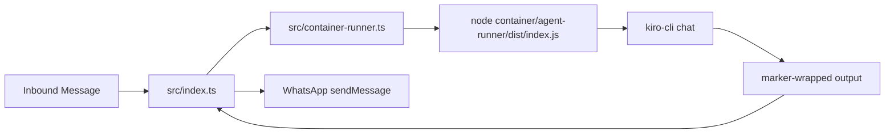

# How NanoClaw Launches Kiro CLI

Note: filename kept as `Launch_Claude.md` for historical continuity. Content reflects current Kiro runtime.

## Code Path

1. `src/index.ts` decides a group needs processing.
2. `runContainerAgent(...)` in `src/container-runner.ts` spawns:
   - `node container/agent-runner/dist/index.js`
3. `container/agent-runner/src/index.ts` runs `kiro-cli chat`.
4. Parsed output is emitted between markers:
   - `---NANOCLAW_OUTPUT_START---`
   - `---NANOCLAW_OUTPUT_END---`
5. Host callback forwards visible text to WhatsApp.

## Launch Diagram

## What Runner Prepares

Host side (`src/container-runner.ts`):
- group working directory
- per-group IPC directories
- per-group session/log directories
- process env values (`NANOCLAW_*`)

Agent side (`container/agent-runner/src/index.ts`):
- resolves Kiro agent name
- ensures `nanoclaw` MCP in Kiro config
- launches `kiro-cli chat ...`
- normalizes stdout/stderr into result text

## IPC During Live Runs

Runner supports follow-up input via:
- `data/ipc/<group>/input/*.json`
- `_close` sentinel file for graceful session end

This is how host can pipe additional text while runner loop is active.

## Failure Signals

Typical failure signatures:
- `Failed to start kiro-cli`
- non-zero exit with stderr summary
- long-running task blocking queue for same group

Use logs:
- `logs/nanoclaw.log`
- `logs/nanoclaw.error.log`
