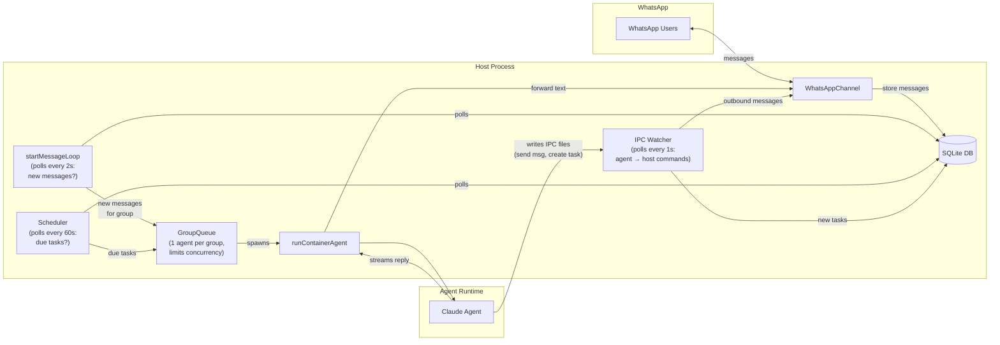
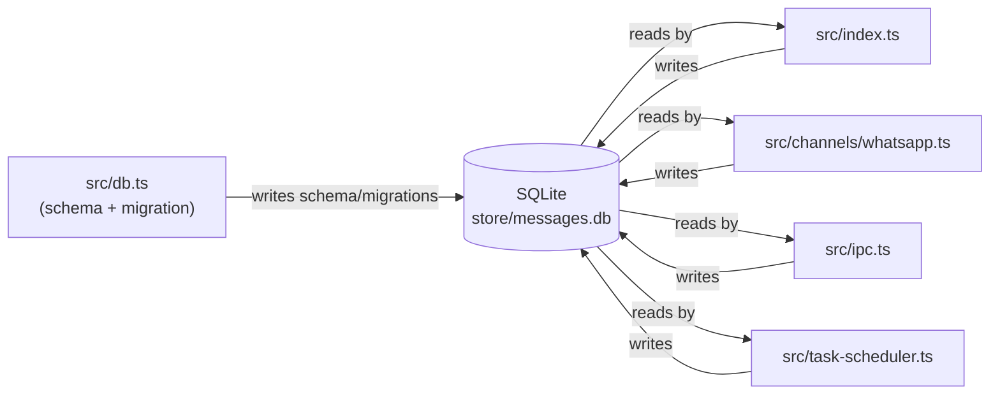
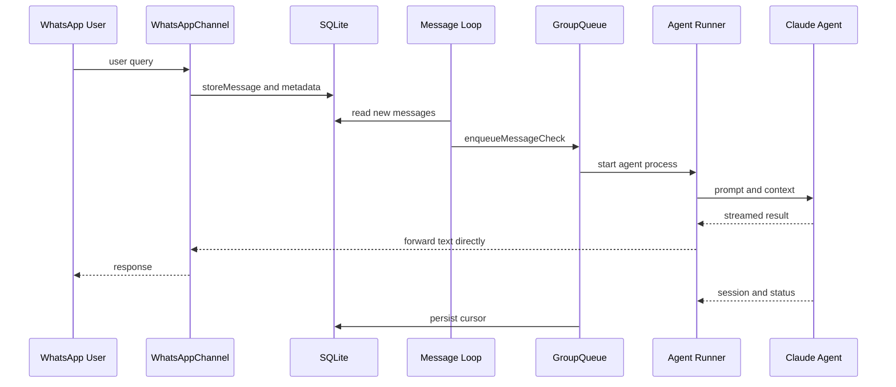
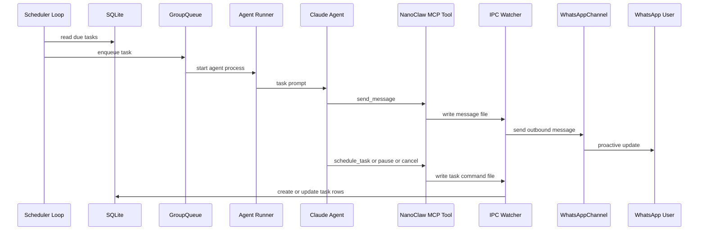

# NanoClaw Architecture

NanoClaw is a single Node.js process that connects WhatsApp to Claude Code agents. The host process orchestrates WhatsApp I/O, persistence, scheduling, queueing, IPC, and agent lifecycle.

Current implementation note: in this branch, `runContainerAgent` starts `container/agent-runner` as a Node child process with per-group isolation via dedicated directories and environment wiring.



The four loops/components have distinct roles:
- **MessageLoop** is the inbound trigger — polls SQLite for new WhatsApp messages and routes them to GroupQueue.
- **GroupQueue** is the traffic controller — ensures only one agent runs per group at a time and limits total concurrency.
- **IPC Watcher** is the agent-to-host bridge — the agent can't call WhatsApp or SQLite directly, so it writes JSON files to IPC directories and the watcher picks them up (outbound messages, task creation, group registration).
- **Scheduler** is the cron system — checks for time-based tasks that are due and queues them through GroupQueue, same path as regular messages.

## Building Blocks

### WhatsAppChannel (`src/channels/whatsapp.ts`)
- Wraps the Baileys library to authenticate via QR code, subscribe to `messages.upsert`, and send presence / typing signals.
- Converts WhatsApp LID identifiers into stable phone-based JIDs, persists chat metadata for discovery, and forwards messages only for registered groups.
- When disconnected, queues outbound messages; flushes once the socket reconnects. Handles periodic group metadata syncs and emits callbacks back into the orchestrator.

### SQLite persistence (`src/db.ts`)
- Stores chats, messages, router cursor state, registered groups, sessions, scheduled tasks, and task run logs inside `store/messages.db`.
- Provides helpers to fetch pending messages (`getNewMessages`, `getMessagesSince`), group/session state, and to mutate router state after processing.
- Keeps group folders (under `groups/`) small by treating the DB as the central event log.

**DB location**
- Logical path: `store/messages.db`
- Resolved path: `path.join(STORE_DIR, "messages.db")` where `STORE_DIR = path.resolve(process.cwd(), "store")`
- In your current checkout: `/Users/girpatil/Documents/Coding/ClaudeCode/cowork/nanoclaw/store/messages.db`



### GroupQueue (`src/group-queue.ts`)
- Enforces per-group serialization and a global concurrency limit (`MAX_CONCURRENT_CONTAINERS`).
- Knows which groups already have a live agent process; feeds follow-up messages through IPC files instead of launching a new process.
- Supports both message processing (`processGroupMessages`) and scheduled task work, with exponential backoff retries and graceful shutdown semantics.

### Container Runner (`src/container-runner.ts`)
- Despite the filename, this module currently launches `container/agent-runner/dist/index.js` as a Node child process.
- Builds per-group runtime isolation by provisioning:
  - Dedicated `.claude` session home per group under `data/sessions/...`
  - Dedicated IPC namespace under `data/ipc/<group>/`
  - Optional validated extra mounts exposed through per-group symlinks under `data/extra/<group>/`
- Streams stdout between sentinel markers so host code can forward partial responses immediately (and reset idle timers), records logs, and enforces timeouts.
- Syncs MCP server config from the user's real `~/.claude.json` into each group's session home (`data/sessions/<group>/.claude.json`). This is necessary because agent processes run with `HOME` overridden to the per-group session directory, so they can't see the user's global MCP servers (Composio, Playwright, etc.) without this copy step. The sync happens on every agent spawn inside `buildProcessEnv()`, right before the child process starts — so adding or removing an MCP server from `~/.claude.json` takes effect on the next WhatsApp message without a restart.

### Claude Agent (agent-runner payload)
- The `container/agent-runner` project boots Claude Code for each group run.
- It reads snapshots the host writes (`current_tasks.json`, `available_groups.json`, IPC inputs) and emits structured output framed by sentinel markers.
- Consecutive outputs can signal session changes, partial responses, or `_close` requests; the host updates session IDs and forwards user-visible text via WhatsApp.

### IPC subsystem (`src/ipc.ts`)
- Each group folder gets `data/ipc/<group>/` containing `messages`, `tasks`, and `input` directories used for host ↔ agent communication.
- The host polls these folders (`startIpcWatcher`) to relay outbound WhatsApp messages, schedule/pause/resume/cancel tasks, refresh group metadata, or register new groups.
- Authorization is implicit: the folder path encodes which group issued the request, so non-main groups can only act within their own namespace.

IPC behavior summary:
- NanoClaw MCP tools write JSON command files into `data/ipc/<group>/messages/` and `data/ipc/<group>/tasks/`.
- `IPC Watcher` reads those files.
- Message files are forwarded to WhatsApp via `WhatsAppChannel`.
- Task files are validated and persisted into SQLite (`scheduled_tasks`), or used to update/delete existing tasks.

### Scheduler (`src/task-scheduler.ts`)
- Polls SQLite for due tasks (`getDueTasks`) using cron/interval/time-based scheduling.
- Queues tasks through `GroupQueue` to reuse the same agent orchestration as ad-hoc conversations, including streaming output, idle timers, and session reuse when `context_mode` is `group`.
- Persists run logs and updates `next_run` pointers once executions complete.

### Router utilities (`src/router.ts`)
- Serializes pending messages into an XML-style format Claude understands, strips `<internal>` tags before sending output, and provides helper functions to select the right channel for outbound replies.

## Message Flow

1. **Inbound capture** – Baileys emits `messages.upsert` events. `WhatsAppChannel` stores chat metadata (`storeChatMetadata`) and, for registered JIDs, persists message rows via `storeMessage`.
2. **Polling loop** – `startMessageLoop()` (in `src/index.ts`) calls `getNewMessages()` for all registered JIDs, deduplicates per group, and respects trigger requirements for non-main groups.
3. **Queueing** – If a group already has an active agent process, new context is piped via IPC (`GroupQueue.sendMessage`). Otherwise `GroupQueue.enqueueMessageCheck` schedules work which will call `processGroupMessages` for that group.
4. **Prompt preparation** – `processGroupMessages` pulls every pending message since the last agent cursor, enforces trigger checks, formats the history with `formatMessages`, and updates router state optimistically while remembering the previous cursor for retries.
5. **Claude execution** – `runAgent` writes the latest task & group snapshots, then `runContainerAgent` starts `agent-runner`. Streaming output flows through the callback provided by `processGroupMessages`, which strips `<internal>` reasoning and forwards visible text via `WhatsAppChannel.sendMessage`.
6. **State updates** – Session IDs returned by Claude are persisted per group, idle timers close stdin when output stops, and on error the cursor can be rolled back so retries reprocess the same backlog.

### Scenario A: Request-response path (default)



Interactive Q&A reply behavior:
- Default path is direct streaming output from agent-runner to host callback to `WhatsAppChannel.sendMessage` (not IPC).
- IPC message files are used when the agent explicitly calls tool `send_message` (for proactive/progress updates or side-channel messaging).

### Scenario B: Agent-initiated and scheduled-task path (IPC tool path)



The IPC tool path can happen during scheduled tasks, proactive heartbeats/checks, and also during normal user conversations when the agent explicitly uses a messaging or task tool.

### NanoClaw MCP tools (current runtime)

The MCP server implemented in `container/agent-runner/src/ipc-mcp-stdio.ts` currently registers these tools:

| Tool | Purpose |
|------|---------|
| `send_message` | Send an immediate outbound message via IPC Watcher -> WhatsAppChannel |
| `schedule_task` | Create a cron/interval/once task for current group (or target group from main) |
| `list_tasks` | List scheduled tasks visible to the current group context |
| `pause_task` | Pause a task by ID |
| `resume_task` | Resume a paused task by ID |
| `cancel_task` | Cancel/delete a task by ID |
| `register_group` | Register a new group (main group only) |

### How tasks are scheduled from a user query

1. User sends a WhatsApp message that asks for recurring/one-time automation.
2. `WhatsAppChannel` persists the inbound message and metadata to SQLite.
3. `startMessageLoop` picks up new rows and queues group processing.
4. Agent runtime receives prompt/context and decides whether to call MCP `schedule_task`.
5. MCP tool validates inputs and writes a task command file to the group IPC `tasks/` directory.
6. `IPC Watcher` reads that file, enforces authorization (main group vs same-group scope), parses schedule type/value, and computes `next_run`.
7. Host persists the task via `createTask(...)` into `scheduled_tasks`.
8. `startSchedulerLoop` polls due tasks every 60s and enqueues runs through `GroupQueue`.
9. Due task executes via `runContainerAgent`; results can be sent to WhatsApp, and run metadata is saved via `logTaskRun(...)` + `updateTaskAfterRun(...)`.

Notes:
- Supported schedule types: `cron`, `interval`, `once`.
- Scheduling for another group is only allowed from main-group context.

## Control Loops

NanoClaw uses three long-running loops, each isolated but sharing the same process:
- **Message loop (`startMessageLoop`)** – Polls SQLite every `POLL_INTERVAL` (2s) for new WhatsApp messages, pipes them into active processes, or schedules fresh runs.
- **Scheduler loop (`startSchedulerLoop`)** – Checks for due scheduled tasks every `SCHEDULER_POLL_INTERVAL` (60s), verifies they are still active, and executes them through the queue.
- **IPC watcher (`startIpcWatcher`)** – Scans per-group IPC directories every `IPC_POLL_INTERVAL` (1s) for outbound messages or management commands authored by Claude via MCP tools.

Each loop is resilient: errors are caught and logged so the loop keeps ticking, and `recoverPendingMessages()` ensures no data is lost if the process crashes between advancing cursors and actually invoking an agent.

## 24x7 Background Service

NanoClaw runs as a macOS **launchd agent**. `launchd` is the macOS system service manager (equivalent of `systemd` on Linux or Windows Services). A `launchd agent` is a specific type of service that runs under the user session, as opposed to a `launchd daemon` which runs as root:

| Type | Path | Runs as | When |
|------|------|---------|------|
| User agent | `~/Library/LaunchAgents/` | Your user | When logged in |
| Global agent | `/Library/LaunchAgents/` | All users, per-user | When any user logs in |
| System daemon | `/Library/LaunchDaemons/` | root | Always (even before login) |

`launchctl` is the command-line tool for talking to launchd. The key commands:

- **`launchctl load <plist>`** — Registers the plist with launchd and starts the process immediately (because `RunAtLoad=true`). After this, launchd "owns" the service — it auto-restarts on crash and re-launches on login.
- **`launchctl unload <plist>`** — Deregisters the service and stops the process. Launchd forgets about it.

The path `~/Library/LaunchAgents/com.nanoclaw.plist` breaks down as:

| Part | Meaning |
|------|---------|
| `~` | Your home directory (`/Users/<you>`) |
| `Library/` | macOS per-user system config folder (hidden in Finder by default) |
| `LaunchAgents/` | The folder launchd scans for user-level agents |
| `com.nanoclaw.plist` | The config file — reverse-DNS naming is an Apple convention |

During `/setup`, the plist template from `launchd/com.nanoclaw.plist` gets its `{{placeholders}}` filled in and copied to `~/Library/LaunchAgents/`.

The plist config file controls how launchd manages NanoClaw:

| Plist key | Value | What it does |
|-----------|-------|-------------|
| `Label` | `com.nanoclaw` | Unique service identifier used in `launchctl` commands |
| `ProgramArguments` | `[node, dist/index.js]` | The command to run — equivalent to `node dist/index.js` |
| `WorkingDirectory` | project root | Sets `cwd` so relative paths (`store/`, `groups/`, `data/`) resolve correctly |
| `RunAtLoad` | `true` | Start immediately when loaded and on every login |
| `KeepAlive` | `true` | Auto-restart if the process exits for any reason (crash, OOM, bug) |
| `EnvironmentVariables` | PATH, HOME, ASSISTANT_NAME | Environment vars passed to the process |
| `StandardOutPath` | `logs/nanoclaw.log` | stdout destination |
| `StandardErrorPath` | `logs/nanoclaw.error.log` | stderr destination |

Startup sequence in `src/index.ts`:
1. **Initialize SQLite** — Opens `store/messages.db`, loads registered groups, session IDs, cursor positions.
2. **Connect WhatsApp** — Uses saved credentials in `store/auth/` to reconnect (no QR code needed after first auth).
3. **Start loops** — Three independent polling loops begin (message loop every 2s, scheduler every 60s, IPC watcher every 1s).
4. **Recover pending** — Checks if any messages were received but not processed before a previous crash, reprocesses them.

Graceful shutdown handles `SIGTERM` and `SIGINT`:
- Disconnects the WhatsApp socket cleanly so WhatsApp servers know the client is offline.
- Stops queue intake so in-flight agent processes can finish, then exits.

Common commands:

```bash
launchctl list | grep nanoclaw                              # Check if running
tail -f logs/nanoclaw.log                                   # Live logs
launchctl unload ~/Library/LaunchAgents/com.nanoclaw.plist  # Stop
launchctl load ~/Library/LaunchAgents/com.nanoclaw.plist    # Start
```

Restarting the application:

```bash
# Simple restart (production)
launchctl unload ~/Library/LaunchAgents/com.nanoclaw.plist && \
launchctl load ~/Library/LaunchAgents/com.nanoclaw.plist

# Restart after code changes (rebuild first)
npm run build && \
launchctl unload ~/Library/LaunchAgents/com.nanoclaw.plist && \
launchctl load ~/Library/LaunchAgents/com.nanoclaw.plist

# Dev mode (Ctrl+C to stop, then rerun)
npm run dev
```

Note: MCP server config changes do **not** require a restart — the config is re-synced from `~/.claude.json` on every agent spawn.

## Claude Agent’s Responsibilities

- Interpret `CLAUDE.md` memories plus the formatted `<messages>` payload to craft responses.
- Stream responses back to the host with sentinel-framed JSON objects (`{status, result, newSessionId}`), allowing real-time replies, session tracking, and detection of errors.
- Issue MCP tool calls that create IPC files for messaging, task scheduling, group management, or custom skills.
- Honor `_close` sentinel files written by the host to wind down gracefully after idle periods so the agent process exits cleanly.

## WhatsApp Configuration

### First-time setup

Run `/setup` inside Claude Code. It walks through everything interactively — dependencies, WhatsApp auth, group selection, trigger word, and launchd service configuration.

### Re-authentication

If WhatsApp credentials expire, re-scan the QR code:

```bash
npm run auth
```

This opens a QR code in the terminal. Scan it with WhatsApp on your phone (Settings → Linked Devices → Link a Device). Credentials are saved to `store/auth/` and reused on subsequent restarts.

### Registering new groups or changing trigger word

These are SQLite operations that `/setup` handles during first-time configuration. After initial setup, use the `/customize` skill to add channels, change triggers, or modify behavior.

### Connection Details

- Uses Baileys multi-device auth stored under `store/auth`. During `/setup`, the user scans a QR code once; subsequent restarts reuse saved credentials.
- Connection lifecycle is driven by `connection.update`:
  - On `open`, marks connected, sends `available` presence, flushes queued outbound messages, and syncs group metadata.
  - On `close`, auto-reconnects unless logout is explicit.
- Inbound events come from `messages.upsert`; messages are normalized (text/caption), translated from LID JIDs when needed, and persisted via callbacks.
- Maintains typing indicators by sending `composing` and `paused` presence updates during processing.
- Prefixes outbound text with `ASSISTANT_NAME` unless the assistant has its own dedicated phone number, ensuring clarity in shared-number scenarios.
- Synchronizes group metadata on startup and every 24 hours (or on-demand via IPC) so new WhatsApp groups can be registered from the main channel.

## Looping & Resilience Notes

- **Idle timers** – Both message-driven runs and scheduled tasks create timers that call `queue.closeStdin()` after `IDLE_TIMEOUT` of silence, nudging the agent process to exit.
- **Backoff** – `GroupQueue` retries failed `processGroupMessages` calls with exponential backoff up to five attempts before waiting for new inbound activity.
- **State snapshots** – `writeTasksSnapshot` and `writeGroupsSnapshot` keep JSON files under each group’s IPC namespace so agent-runner can read static context without touching SQLite directly.
- **Outbound buffering** – WhatsAppChannel queues outbound messages while disconnected and flushes them on reconnect.
- **Launchd supervision** – `KeepAlive` provides process-level self-healing if NanoClaw crashes.

Together, these components form a tight feedback loop: WhatsApp events land in SQLite, loops detect work, `GroupQueue` serializes it, `runContainerAgent` starts Claude agent-runner, and IPC/messaging subsystems bridge agent output back to WhatsApp. The codebase stays small so each piece can be reasoned about and modified safely.

## Container vs Containerless Execution

NanoClaw supports two modes for running agent-runner. The codebase was originally built around Apple Container (Linux VMs on macOS), then refactored to also run as a direct Node.js child process. The stdin/stdout JSON protocol and all callers (`GroupQueue`, scheduler, IPC) remain identical — only the process spawning and isolation layer differ.

### Comparison

| Aspect | Container (Apple Container / Docker) | Containerless (current) |
|--------|--------------------------------------|------------------------|
| **Spawn command** | `spawn('container', ['run', ...])` or `docker run` | `spawn('node', ['container/agent-runner/dist/index.js'])` |
| **Filesystem isolation** | Linux VM with bind mounts (`--mount type=bind,...`) | `HOME` env var override + symlinks for extra mounts |
| **Path resolution** | Hardcoded `/workspace/group`, `/workspace/ipc`, etc. | Environment variables: `NANOCLAW_GROUP_DIR`, `NANOCLAW_IPC_DIR`, `NANOCLAW_GLOBAL_DIR`, `NANOCLAW_EXTRA_DIR` |
| **Session isolation** | Container filesystem is ephemeral; `.claude/` mounted in | `HOME=data/sessions/<group>/` so `~/.claude/` resolves per-group |
| **MCP servers** | Not applicable (no user-level config inside VM) | Synced from user's `~/.claude.json` into each session home |
| **Process lifecycle** | `exec('container stop <name>')` | `SIGTERM` → 15s grace → `SIGKILL` |
| **Build step** | `container build` or `docker build` from `container/Dockerfile` | `npm run build` (compiles agent-runner TypeScript on host) |
| **Startup dependency** | Container runtime must be running (`container system start`) | None — just Node.js |
| **Browser automation** | Chromium installed inside container image | Requires Chromium/Playwright on host or via MCP |
| **Security boundary** | Full Linux VM sandbox (network, filesystem, process) | OS-level process isolation only; agent has host filesystem access scoped by `HOME` and symlinks |

### How the containerless refactor works

The agent-runner code (`container/agent-runner/src/`) was originally written with hardcoded `/workspace/*` paths matching the container's filesystem layout. The refactor introduced environment variable fallbacks:

```typescript
const GROUP_DIR   = process.env.NANOCLAW_GROUP_DIR   || '/workspace/group';
const IPC_BASE_DIR = process.env.NANOCLAW_IPC_DIR    || '/workspace/ipc';
const GLOBAL_DIR  = process.env.NANOCLAW_GLOBAL_DIR  || '/workspace/global';
const EXTRA_DIR   = process.env.NANOCLAW_EXTRA_DIR   || '/workspace/extra';
```

When running containerless, `src/container-runner.ts` sets these env vars to host paths (`groups/<folder>/`, `data/ipc/<folder>/`, etc.) and spawns `node` directly. When running in a container, the env vars are absent and the `/workspace/*` defaults apply — so the same agent-runner binary works in both modes.

### Switching back to containers

To restore container-based execution:
1. Ensure Apple Container or Docker is running
2. Build the image: `./container/build.sh` (or `docker build -t nanoclaw-agent:latest -f container/Dockerfile container/`)
3. Restore `CONTAINER_IMAGE` in `src/config.ts`
4. Restore `ensureContainerSystemRunning()` in `src/index.ts`
5. Change `spawn('node', ...)` back to `spawn('container', containerArgs)` in `src/container-runner.ts`

The agent-runner code requires no changes — it falls back to `/workspace/*` paths when env vars are absent.

## Comparision with original specs

This section highlights where `docs/SPEC.md` differs from current runtime behavior.

| Topic | `docs/SPEC.md` | Current runtime (`src/*`, `container/agent-runner/*`) |
|------|-----------------|---------------------------|
| WhatsApp reply path | Architecture diagram implies WhatsApp sends/reads through SQLite (`docs/SPEC.md:32-34`) | Outbound replies are sent directly by host code via `WhatsAppChannel.sendMessage` from either `runContainerAgent` stream callbacks (`src/index.ts`, `src/task-scheduler.ts`) or IPC Watcher (`src/ipc.ts`) |
| Scheduled-task messaging | “Optional messaging via `send_message` tool” suggests tool/IPC path (`docs/SPEC.md:407`) | Scheduled tasks also send direct streamed results through scheduler callback (`src/task-scheduler.ts:117-121`); IPC `send_message` is additional |
| MCP tool list | Includes `get_task` and `update_task` (`docs/SPEC.md:471-472`) | Current MCP server registers 7 tools: `send_message`, `schedule_task`, `list_tasks`, `pause_task`, `resume_task`, `cancel_task`, `register_group` (`container/agent-runner/src/ipc-mcp-stdio.ts`) |
| Execution model | Described as Apple Container-first architecture (`docs/SPEC.md:45-58`, `docs/SPEC.md:487`) | Current branch runs `agent-runner` as a Node child process by default (`src/container-runner.ts`), with container-oriented paths retained as compatibility context in docs |
| One-time schedule format examples | Shows UTC `Z` timestamps (`docs/SPEC.md:416`, `docs/SPEC.md:442`) | Current MCP tool docs prefer local timestamp without `Z` for `once` in `schedule_task` description (`container/agent-runner/src/ipc-mcp-stdio.ts`) |

**Note — stale `send_message` tool description:** The `send_message` tool description in `ipc-mcp-stdio.ts` claims "when running as a scheduled task, your final output is NOT sent to the user." This is incorrect — the streaming callback in `task-scheduler.ts:116-127` **does** forward the agent's final result via `deps.sendMessage`. In practice this means a scheduled task agent that calls `send_message` explicitly (because it trusts the tool description) will deliver the content via IPC, and then its final SDK result (e.g. "Done, sent the update") also gets delivered via the streaming path — resulting in duplicate or unnecessary messages. Either the tool description should be corrected to remove the stale note, or the streaming callback should be removed for scheduled tasks.

Bottom line:
- `docs/SPEC.md` captures the original design intent.
- `architecture.md` is now aligned to how this branch actually runs today.

## Starting the Agent

### Prerequisites

- Node.js >= 20
- A Claude subscription (Pro/Max) with `CLAUDE_CODE_OAUTH_TOKEN` in `.env`, or an API key as `ANTHROPIC_API_KEY`
- WhatsApp account (authentication via QR code on first run)

### First-time setup

Run `/setup` inside Claude Code — it walks through dependency installation, WhatsApp auth, group registration, and service configuration interactively.

### Build

```bash
npm run build          # Compiles host TypeScript + agent-runner
npm run build:agent    # Compiles only agent-runner
```

These are two separate TypeScript projects with their own `tsconfig.json`. The host compiles `src/` → `dist/`, the agent-runner compiles `container/agent-runner/src/` → `container/agent-runner/dist/`. `npm run build` runs both in sequence (`tsc && cd container/agent-runner && npm install && npm run build`). `npm run build:agent` skips the host and only compiles the agent-runner.

| Scenario | Command |
|----------|---------|
| Changed anything in `src/` (host code) | `npm run build` |
| Changed only `container/agent-runner/src/` | `npm run build:agent` |
| First time or unsure | `npm run build` |

### Run (development)

```bash
npm run dev            # Builds agent-runner, then runs host with tsx
```

### Run (production — launchd)

The `launchd/com.nanoclaw.plist` template has `{{placeholders}}` filled by `/setup`. Once installed:

```bash
# Load (starts immediately and persists across reboots)
launchctl load ~/Library/LaunchAgents/com.nanoclaw.plist

# Unload (stops the service)
launchctl unload ~/Library/LaunchAgents/com.nanoclaw.plist

# Restart
launchctl unload ~/Library/LaunchAgents/com.nanoclaw.plist && \
launchctl load ~/Library/LaunchAgents/com.nanoclaw.plist
```

### Logs

```
logs/nanoclaw.log         # stdout
logs/nanoclaw.error.log   # stderr
groups/<name>/logs/       # per-group agent run logs
logs/setup.log            # setup script output

tail -f logs/nanoclaw.log #command to monitor logs real time
```

### WhatsApp re-authentication

If WhatsApp credentials expire, re-scan the QR code:

```bash
npm run auth
```

### After a machine restart

You don't need to do anything. NanoClaw starts automatically because:

- `RunAtLoad=true` in the plist means launchd starts NanoClaw on login
- `KeepAlive=true` means it restarts if it crashes
- WhatsApp credentials are persisted in `store/auth/` — no QR re-scan needed
- Registered groups and trigger words are in SQLite — persistent

Just log in to your Mac and send a message to your registered group. The only time manual action is needed is if WhatsApp invalidates your linked device (typically after ~14 days of inactivity or if you unlink from your phone) — in that case run `npm run auth`.

### Health checks

Verify each component is working:

```bash
# 1. Is the service running?
#    Look for com.nanoclaw — second column 0 means healthy, non-zero means last exit had an error
launchctl list | grep nanoclaw
# Example output: 52467  0  com.nanoclaw
#                 ^PID   ^exit code

# 2. Is the plist installed?
ls ~/Library/LaunchAgents/com.nanoclaw.plist
# Should show the file — if missing, run /setup or manually copy the plist

# 3. Is WhatsApp authenticated?
ls store/auth/
# Should show app-state-sync-key-*.json files — if empty, run: npm run auth

# 4. Are groups registered?
sqlite3 store/messages.db "SELECT jid, name, folder, trigger_pattern FROM registered_groups;"
# Should show your registered group(s) — if empty, run /setup or /customize

# 5. Are logs flowing? (live tail)
tail -f logs/nanoclaw.log
```

All-in-one quick check:

```bash
echo "=== Service ===" && launchctl list | grep nanoclaw && \
echo "=== Plist ===" && ls ~/Library/LaunchAgents/com.nanoclaw.plist && \
echo "=== WhatsApp Auth ===" && ls store/auth/ | head -3 && \
echo "=== Registered Groups ===" && sqlite3 store/messages.db "SELECT name, trigger_pattern FROM registered_groups;"
```
