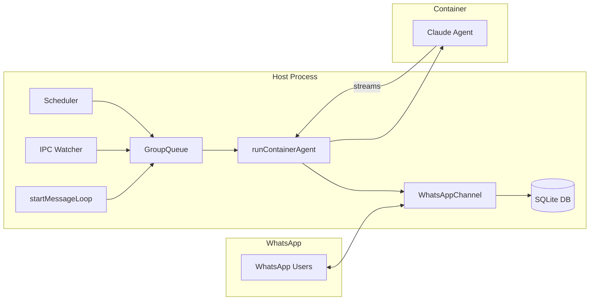
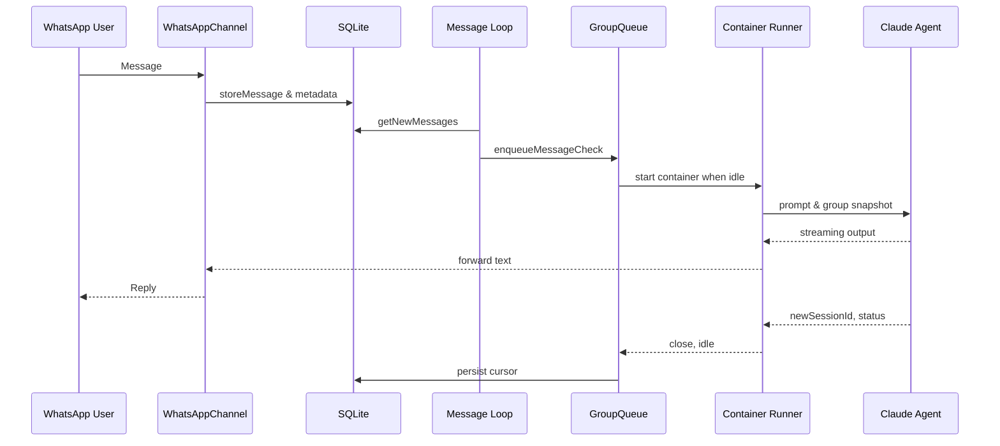

# NanoClaw Architecture

NanoClaw is a single Node.js process that connects WhatsApp to Claude Code agents running inside isolated Apple Container (or Docker) sandboxes. The host process orchestrates WhatsApp I/O, persistence, scheduling, queueing, IPC, and container lifecycle.

## Building Blocks

### WhatsAppChannel (`src/channels/whatsapp.ts`)
- Wraps the Baileys library to authenticate via QR code, subscribe to `messages.upsert`, and send presence / typing signals.
- Converts WhatsApp LID identifiers into stable phone-based JIDs, persists chat metadata for discovery, and forwards messages only for registered groups.
- When disconnected, queues outbound messages; flushes once the socket reconnects. Handles periodic group metadata syncs and emits callbacks back into the orchestrator.

### SQLite persistence (`src/db.ts`)
- Stores chats, messages, router cursor state, registered groups, sessions, scheduled tasks, and task run logs inside `store/messages.db`.
- Provides helpers to fetch pending messages (`getNewMessages`, `getMessagesSince`), group/session state, and to mutate router state after processing.
- Keeps group folders (under `groups/`) small by treating the DB as the central event log.

### GroupQueue (`src/group-queue.ts`)
- Enforces per-group serialization and a global concurrency limit (`MAX_CONCURRENT_CONTAINERS`).
- Knows which groups already have a live container; feeds follow-up messages through IPC files instead of launching a new container.
- Supports both message processing (`processGroupMessages`) and scheduled task work, with exponential backoff retries and graceful shutdown semantics.

### Container Runner (`src/container-runner.ts`)
- Spawns the Claude agent inside Apple Container/Docker using the `container` CLI, mounting only the folders each group should see:
  - Main group gets the repo + its group folder; other groups only see their own folder plus optional read-only global memory.
  - Each group receives isolated `.claude` sessions, IPC namespaces, opt-in additional mounts, copies of skills, and optional secrets via stdin.
- Streams stdout between sentinel markers so host code can forward partial responses immediately (and reset idle timers), records logs, enforces timeouts, and cleans up containers.

### Claude Agent (container payload)
- The `container/agent-runner` project boots Claude Code inside the isolated container.
- It reads snapshots the host writes (`current_tasks.json`, `available_groups.json`, IPC inputs) and emits structured output framed by sentinel markers.
- Consecutive outputs can signal session changes, partial responses, or `_close` requests; the host updates session IDs and forwards user-visible text via WhatsApp.

### IPC subsystem (`src/ipc.ts`)
- Each group folder gets `data/ipc/<group>/` containing `messages`, `tasks`, and `input` directories used for host ↔ agent communication.
- The host polls these folders (`startIpcWatcher`) to relay outbound WhatsApp messages, schedule/pause/resume/cancel tasks, refresh group metadata, or register new groups.
- Authorization is implicit: the folder path encodes which group issued the request, so non-main groups can only act within their own namespace.

### Scheduler (`src/task-scheduler.ts`)
- Polls SQLite for due tasks (`getDueTasks`) using cron/interval/time-based scheduling.
- Queues tasks through `GroupQueue` to reuse the same container orchestration as ad-hoc conversations, including streaming output, idle timers, and session reuse when `context_mode` is `group`.
- Persists run logs and updates `next_run` pointers once executions complete.

### Router utilities (`src/router.ts`)
- Serializes pending messages into an XML-style format Claude understands, strips `<internal>` tags before sending output, and provides helper functions to select the right channel for outbound replies.

## Message Flow

1. **Inbound capture** – Baileys emits `messages.upsert` events. `WhatsAppChannel` stores chat metadata (`storeChatMetadata`) and, for registered JIDs, persists message rows via `storeMessage`.
2. **Polling loop** – `startMessageLoop()` (in `src/index.ts`) calls `getNewMessages()` for all registered JIDs, deduplicates per group, and respects trigger requirements for non-main groups.
3. **Queueing** – If a group already has an active container, new context is piped via IPC (`GroupQueue.sendMessage`). Otherwise `GroupQueue.enqueueMessageCheck` schedules work which will call `processGroupMessages` for that group.
4. **Prompt preparation** – `processGroupMessages` pulls every pending message since the last agent cursor, enforces trigger checks, formats the history with `formatMessages`, and updates router state optimistically while remembering the previous cursor for retries.
5. **Claude execution** – `runAgent` writes the latest task & group snapshots, then `runContainerAgent` starts the sandbox. Streaming output flows through the callback provided by `processGroupMessages`, which strips `<internal>` reasoning and forwards visible text via `WhatsAppChannel.sendMessage`.
6. **State updates** – Session IDs returned by Claude are persisted per group, idle timers close stdin when output stops, and on error the cursor can be rolled back so retries reprocess the same backlog.

## Control Loops

NanoClaw uses three long-running loops, each isolated but sharing the same process:
- **Message loop (`startMessageLoop`)** – Polls SQLite every `POLL_INTERVAL` milliseconds for new WhatsApp messages, pipes them into active containers, or schedules fresh runs.
- **Scheduler loop (`startSchedulerLoop`)** – Checks for due scheduled tasks every `SCHEDULER_POLL_INTERVAL`, verifies they are still active, and executes them through the queue.
- **IPC watcher (`startIpcWatcher`)** – Scans per-group IPC directories every `IPC_POLL_INTERVAL` for outbound messages or management commands authored by Claude via MCP tools.

Each loop is resilient: errors are caught and logged so the loop keeps ticking, and `recoverPendingMessages()` ensures no data is lost if the process crashes between advancing cursors and actually invoking an agent.

## Claude Agent’s Responsibilities

- Interpret `CLAUDE.md` memories plus the formatted `<messages>` payload to craft responses.
- Stream responses back to the host with sentinel-framed JSON objects (`{status, result, newSessionId}`), allowing real-time replies, session tracking, and detection of errors.
- Issue MCP tool calls that create IPC files for messaging, task scheduling, group management, or custom skills.
- Honor `_close` sentinel files written by the host to wind down gracefully after idle periods so containers exit cleanly.

## WhatsApp Connection Details

- Uses Baileys multi-device auth stored under `store/auth`. During `/setup`, the user scans a QR code once; subsequent restarts reuse saved credentials.
- Handles reconnects: if the socket closes for anything other than logout, `connectInternal` retries with exponential delay. When logged out, the process exits so `/setup` can reauthenticate.
- Maintains a presence heartbeat by sending `available`, `composing`, and `paused` updates so typing indicators appear in chats.
- Prefixes outbound text with `ASSISTANT_NAME` unless the assistant has its own dedicated phone number, ensuring clarity in shared-number scenarios.
- Synchronizes group metadata on startup and every 24 hours (or on-demand via IPC) so new WhatsApp groups can be registered from the main channel.

## Looping & Resilience Notes

- **Idle timers** – Both message-driven runs and scheduled tasks create timers that call `queue.closeStdin()` after `IDLE_TIMEOUT` of silence, nudging the agent to exit.
- **Backoff** – `GroupQueue` retries failed `processGroupMessages` calls with exponential backoff up to five attempts before waiting for new inbound activity.
- **State snapshots** – `writeTasksSnapshot` and `writeGroupsSnapshot` keep JSON files under each group’s IPC namespace so the container can read static context without touching SQLite directly.
- **Container hygiene** – Startup ensures `container system` is running, kills orphaned `nanoclaw-*` containers, and writes detailed per-run logs (including truncated stdout/stderr) for debugging.

Together, these components form a tight feedback loop: WhatsApp events land in SQLite, loops detect work, `GroupQueue` serializes it, `runContainerAgent` spins up Claude in an isolated sandbox, and IPC/messaging subsystems bridge the container back to WhatsApp. The codebase stays small so each piece can be reasoned about and modified safely.
